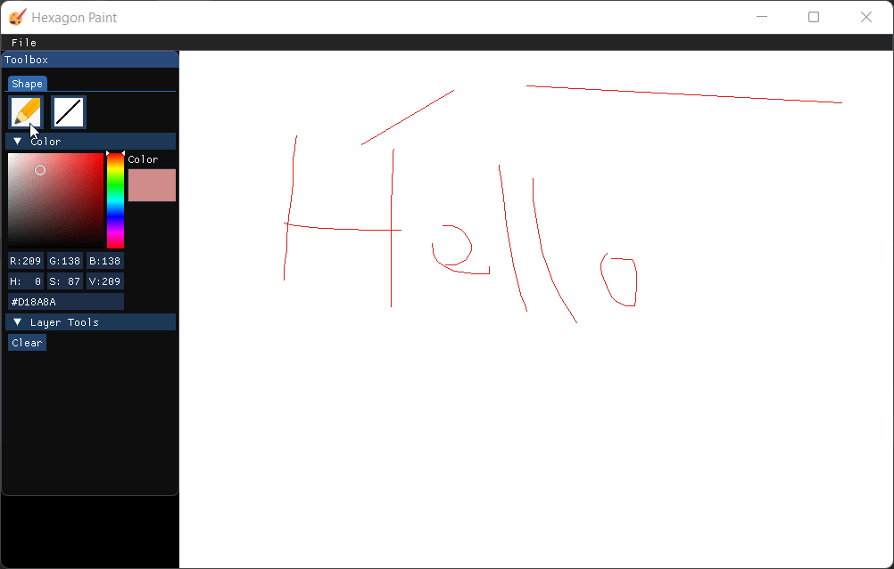
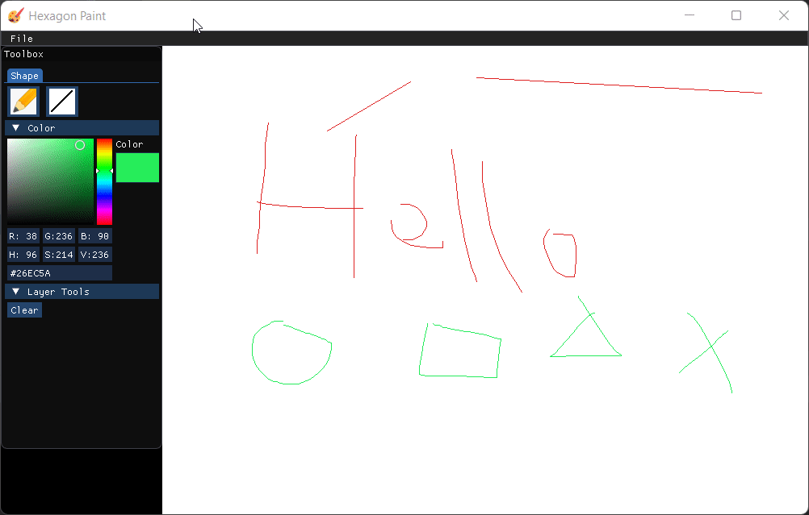
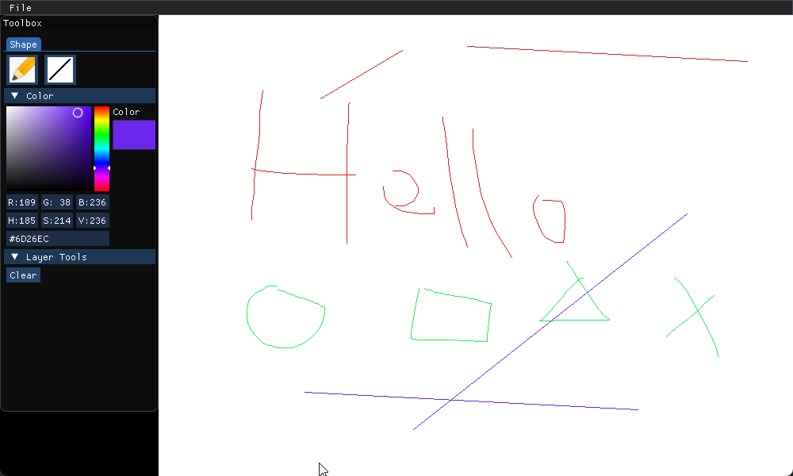

# Hexagon Paint

This repository is dedicated for my Computer Graphics and Animation (CIT207) course

Project requirement

```
Create an application that allows the user to draw lines on a screen. The
application should be able to do the following:
● Draw a dot on the screen.
● Draw a line on the screen.
● Change colour.
● Clear the screen.
● Save/load the contents of the screen to/from a file.
● Set the width of a line (1 – 5 pixels).
● Draw a dotted line.
● Bonus points for user friendliness. Negative points for extreme user
unfriendliness.
You must create your own procedure to draw a line (use the DDA algorithm).
You cannot use the bulit-in line drawing procedure.
```

https://drive.google.com/open?id=1KWUTyayYVD_g-uJN614gGsWqAmayvnhp

## Features

- Draw using pen tool
- Draw line
- Clear canvas
- Color selection
- Load and save image in PNG format

## Screenshot





## Building

### Prerequisites

- CMake >= 3.10
- C++17 supported compiler

### Installation

- Clone to local
- Pull the dependencies

```
git submodule update --recursive --remote
```

- Rename the `lib/lodepng/lodepng.cpp` to `lib/lodepng/lodepng.c`

## License

[MIT Licensed](LICENSE)
